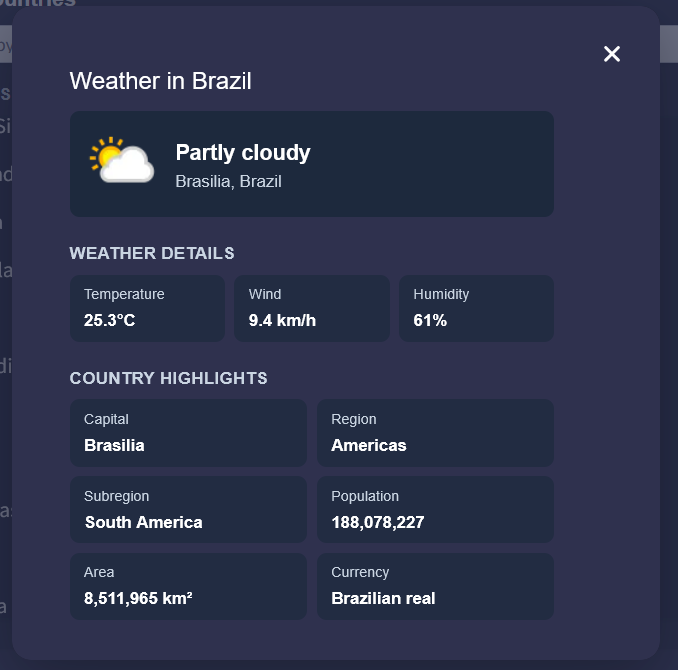

# Worktables Hiring Test — Full Stack Monorepo

<table>
  <tr>
    <td align="center">
      
    </td>
    <td align="center">
      
    </td>
  </tr>
</table>
This repository implements the **Worktables Full Stack Developer Hiring Test** as a monorepo with:

- **Frontend (`apps/web`)**: Next.js + TypeScript app rendered in monday.com Board View.
- **Backend (`apps/api`)**: Express + TypeScript REST API that fetches weather data from WeatherAPI.
- **Shared package (`packages/types`)**: common API/weather TypeScript interfaces/types.
- **Shared TS configs (`packages/ts-config`)**: reusable strict TypeScript presets.

### Frontend

- Uses **Next.js** and **TypeScript**.
- Fetches countries from monday board via `monday-sdk-js`.
- Calls backend weather route and renders weather in modal.
- Responsive layout and modern UI components from monday ecosystem (`@vibe/core`).

### Backend

- Uses **Express framwork** + **TypeScript**.
- Calls **WeatherAPI** using API key.
- Includes basic error handling middleware and input validation.

---

## Monorepo Structure

```txt
worktables/
├─ apps/
│  ├─ api/                          # Express API (TypeScript)
│  │  ├─ src/
│  │  │  ├─ index.ts
│  │  │  ├─ routes/weather.route.ts
│  │  │  ├─ controllers/weather.controller.ts
│  │  │  ├─ services/weather.service.ts
│  │  │  └─ middleware/error.middleware.ts
│  │  ├─ package.json
│  │  └─ tsconfig.json
│  └─ web/                          # Next.js app (TypeScript)
│     ├─ app/
│     │  ├─ layout.tsx
│     │  ├─ page.tsx
│     │  └─ globals.css
│     ├─ components/
│     │  ├─ ListCountry.tsx
│     │  └─ list-country/
│     │     ├─ CountrySearch.tsx
│     │     ├─ CountryList.tsx
│     │     ├─ WeatherModal.tsx
│     │     ├─ useCountryWeather.ts
│     │     ├─ api.ts
│     │     ├─ types.ts
│     │     └─ utils.ts
│     ├─ next.config.ts
│     ├─ package.json
│     └─ tsconfig.json
├─ packages/
│  ├─ types/                        # Shared interfaces for weather payloads/errors
│  └─ ts-config/                    # Shared tsconfig presets
├─ .env.example						          # .env configs example
├─ docker-compose.yml
├─ Dockerfile
├─ package.json
└─ bun.lock
```

---

## Prerequisites

- **Bun** installed (recommended if running local).
- **Node.js**.
- A valid **WeatherAPI key**.
- Access to the monday.com board/view.

---

## Environment Variables

Create a `.env` file in the repository root (or copy from `.env.example`):

```env
# Port where backend API runs
API_PORT=3001

# WeatherAPI key (https://www.weatherapi.com/)
WEATHER_API_KEY=your_weather_api_key_here

# Port where frontend runs
WEB_PORT=3000
```

> Important: `WEATHER_API_KEY` is required for backend weather requests.

---
## How to Run

First, clone the project 
```bash
git clone https://github.com/nivdantas/worktables-fullstack.git
```
## Docker (How to Run)

Build and run both services:

```bash
docker compose up --build
```

Services:

- `worktables-web` on `${WEB_PORT:-3000}`
- `worktables-api` on `${API_PORT:-3001}`

Make sure `WEATHER_API_KEY` is available in environment before launching compose.

---

---

## Local (How to Run)

From repository root:

```bash
bun install
```

Build and run both apps in start mode:

```bash
bun run build
bun run start
```

Local url/ports:

- Frontend: `http://localhost:3000`
- Backend: `http://localhost:3001`

## Frontend Architecture

- `components/ListCountry.tsx`  
  Composes search, list and modal.

Feature folder (`components/list-country`):

- `useCountryWeather.ts`
  - Loads board countries via useSWR (Next).
  - Filters countries by search value.
  - Opens weather modal on click.
  - Fetches weather via backend endpoint.
- `api.ts`
  - monday board GraphQL fetch + data mapping.
- `CountrySearch.tsx`  
  Search input and feature heading.
- `CountryList.tsx`  
  Clickable result list.
- `WeatherModal.tsx`  
  Weather + country stats details.
- `utils.ts`
  - text normalization
  - clean null values
  - numeric parsing
  - country query formatting

---

## Backend Architecture

- `src/index.ts`
  - Express initialization
  - CORS config
  - JSON middleware
- `src/routes/weather.route.ts`
  - REST route: `GET /api/weather/:country`
- `src/controllers/weather.controller.ts`
  - validates input
  - delegates to service
- `src/services/weather.service.ts`
  - calls WeatherAPI
  - maps raw API response to app
- `src/middleware/error.middleware.ts`
  - centralized JSON error response

---

Shared interfaces are exported by `@repo/types`.

---

### Antarctica behavior

When selected location query resolves to `"Antarctica"`:

- Weather API request is **not executed**.
- Modal shows a message:

> `Antarctica doesn't have weather data on WeatherAPI.` (because Antarctica isn't a country)

---

### Lighthouse verification

Recent measured scores:

- **Performance:** 96–97
- **Accessibility:** 100
- **Best Practices:** 100
- **SEO:** 100

## Troubleshooting

### `WEATHER_API_KEY is not defined`

Set `WEATHER_API_KEY` in root `.env` and restart API process.
